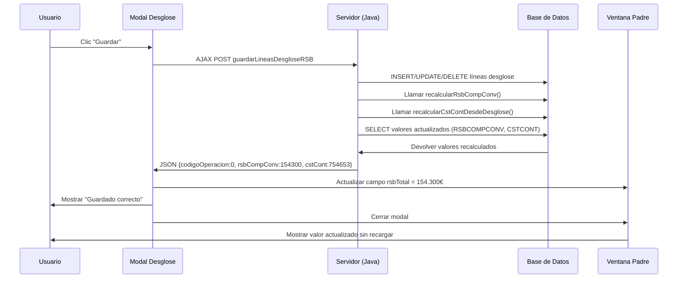

# SOLUCIÓN IMPLEMENTADA: Actualización Automática de Vista tras Guardar Desglose RSB

## ?? Problema Identificado

**Síntoma:** Al guardar el desglose RSB, los valores de RSBCOMPCONV y CSTCONT se actualizaban correctamente en la base de datos, pero **no se reflejaban en la interfaz hasta reentrar al formulario**.

**Causa raíz:** 
1. Falta de recálculo y devolución de valores actualizados en la respuesta JSON
2. La vista modal no actualizaba los campos en la ventana padre
3. No se aplicaba el patrón PRG (Post-Redirect-Get) para forzar recarga de datos

## ? Cambios Implementados

### 1. Backend: Devolución de Valores Actualizados (MELANBIDE11.java)

**Archivo:** `src/java/es/altia/flexia/integracion/moduloexterno/melanbide11/MELANBIDE11.java`

**Método modificado:** `guardarLineasDesgloseRSB()` (línea ~2190)

**Cambios:**
```java
// Añadidas variables para valores actualizados
double rsbCompConv = 0d;
double cstCont = 0d;

// Tras guardar exitosamente, recuperar valores recalculados
if (!ok) {
    codigoOperacion = 2;
} else {
    // Obtener contratación actualizada desde BD
    try {
        ContratacionVO contrato = manager.getContratacion(numExp, dni);
        if (contrato != null) {
            rsbCompConv = contrato.getRsbCompConv() != null ? contrato.getRsbCompConv() : 0d;
            cstCont = contrato.getCstCont() != null ? contrato.getCstCont() : 0d;
        }
    } catch (Exception contEx) {
        log.warn("[guardarLineasDesgloseRSB] No se pudo recuperar contratacion actualizada", contEx);
    }
}

// JSON de respuesta incluye valores actualizados
String json = new StringBuilder()
    .append("{\"resultado\":{\"codigoOperacion\":").append(codigoOperacion)
    .append(",\"salariales\":").append(salariales)
    .append(",\"extrasalariales\":").append(extrasalariales)
    .append(",\"totalComputable\":").append(totalComputable)
    .append(",\"rsbCompConv\":").append(rsbCompConv)  // ? NUEVO
    .append(",\"cstCont\":").append(cstCont)          // ? NUEVO
    .append("}}")
    .toString();
```

**Resultado:**
- El servidor ahora devuelve los valores actualizados de RSBCOMPCONV y CSTCONT tras guardar
- Los valores son leídos directamente desde BD tras el recálculo automático

---

### 2. Manager: Método para Recuperar Contratación Actualizada

**Archivo:** `src/java/es/altia/flexia/integracion/moduloexterno/melanbide11/manager/MeLanbide11Manager.java`

**Nuevo método añadido:** (línea ~1070)

```java
/**
 * Obtiene una contratación específica por número de expediente y DNI.
 * Útil para recuperar valores actualizados tras recálculos automáticos.
 */
public ContratacionVO getContratacion(String numExp, String dni) throws Exception {
    Connection con = null;
    try {
        con = adaptador.getConnection();
        return melanbide11DAO.getContratacionByExpDni(numExp, dni, con);
    } catch (BDException e) {
        log.error("Excepción BBDD obteniendo contratación numExp=" + numExp + ", dni=" + dni, e);
        throw new Exception(e);
    } catch (Exception ex) {
        log.error("Excepción obteniendo contratación numExp=" + numExp + ", dni=" + dni, ex);
        throw new Exception(ex);
    } finally {
        try {
            adaptador.devolverConexion(con);
        } catch (Exception e) {
            log.error("Error al cerrar conexión a la BBDD: " + e.getMessage());
        }
    }
}
```

---

### 3. DAO: Consulta SQL para Recuperar Contratación

**Archivo:** `src/java/es/altia/flexia/integracion/moduloexterno/melanbide11/dao/MeLanbide11DAO.java`

**Nuevo método añadido:** (línea ~1500)

```java
/**
 * Obtiene una contratación específica por número de expediente y DNI.
 * Útil para recuperar valores actualizados (RSBCOMPCONV, CSTCONT) tras guardar desglose.
 */
public ContratacionVO getContratacionByExpDni(String numExp, String dni, Connection con) throws Exception {
    PreparedStatement ps = null;
    ResultSet rs = null;
    try {
        String tabla = ConfigurationParameter.getParameter(ConstantesMeLanbide11.MELANBIDE11_CONTRATACION,
                ConstantesMeLanbide11.FICHERO_PROPIEDADES);
        
        String sql = "SELECT ID, NUM_EXP, DNICONT, RSBSALBASE, RSBPAGEXTRA, RSBIMPORTE, RSBCOMPCONV, CSTCONT "
                + "FROM " + tabla + " "
                + "WHERE TRIM(NUM_EXP) = TRIM(?) "
                + "AND UPPER(REPLACE(REPLACE(TRIM(DNICONT),' ',''),'-','')) = "
                + "    UPPER(REPLACE(REPLACE(TRIM(?),' ',''),'-',''))";
        
        ps = con.prepareStatement(sql);
        ps.setString(1, numExp);
        ps.setString(2, dni);
        rs = ps.executeQuery();
        
        if (rs.next()) {
            ContratacionVO vo = new ContratacionVO();
            vo.setId(rs.getInt("ID"));
            vo.setNumExp(rs.getString("NUM_EXP"));
            vo.setDni(rs.getString("DNICONT"));
            vo.setRsbSalBase(rs.getDouble("RSBSALBASE"));
            vo.setRsbPagExtra(rs.getDouble("RSBPAGEXTRA"));
            vo.setRsbImporte(rs.getDouble("RSBIMPORTE"));
            vo.setRsbCompConv(rs.getDouble("RSBCOMPCONV"));
            vo.setCstCont(rs.getDouble("CSTCONT"));
            return vo;
        }
        return null;
    } finally {
        if (rs != null)
            rs.close();
        if (ps != null)
            ps.close();
    }
}
```

---

### 4. Frontend: Actualización de Vista en Ventana Padre

**Archivo:** `src/web/jsp/extension/melanbide11/desglose/m11Desglose_Tab1.jsp`

**Función modificada:** `procesarRespuestaGuardar()` (línea ~183)

**Cambios:**
```javascript
function procesarRespuestaGuardar(ajaxResult) {
    elementoVisible('off', 'barraProgresoLPEEL');
    
    if (!ajaxResult) {
        console.error('Respuesta vacía al guardar desglose RSB');
        jsp_alerta('A', 'Se ha recibido una respuesta vacía del servidor.');
        return;
    }
    
    try {
        var datos;
        if (typeof ajaxResult === 'string') {
            datos = JSON.parse(ajaxResult);
        } else {
            datos = ajaxResult;
        }

        var codigoOperacion = datos && datos.resultado ? datos.resultado.codigoOperacion : "4";
        
        if (codigoOperacion == "0"){
            console.log("Desglose RSB guardado exitosamente");
            
            // ? NUEVO: Actualizar valores en ventana padre
            try {
                if (datos.resultado && datos.resultado.rsbCompConv !== undefined) {
                    var rsbCompConv = parseFloat(datos.resultado.rsbCompConv) || 0;
                    var cstCont = parseFloat(datos.resultado.cstCont) || 0;
                    
                    console.log("Valores actualizados desde BD:");
                    console.log("  - RSBCOMPCONV:", rsbCompConv);
                    console.log("  - CSTCONT:", cstCont);
                    
                    // Actualizar campo rsbTotal en ventana padre (si existe)
                    if (window.opener && window.opener.document) {
                        var rsbTotalField = window.opener.document.getElementById('rsbTotal');
                        if (rsbTotalField) {
                            rsbTotalField.value = rsbCompConv.toFixed(2).replace('.', ',');
                            console.log("Campo rsbTotal actualizado en ventana padre:", rsbTotalField.value);
                        }
                    }
                }
            } catch (updateErr) {
                console.warn("No se pudo actualizar campos en ventana padre:", updateErr);
            }
            
            jsp_alerta('I', 'Guardado correcto');
            cerrarVentana(['0', 'Desglose RSB guardado exitosamente']); 
        } else if (codigoOperacion == "1") {
            jsp_alerta('A', document.getElementById('errorBD').value);
        } else if (codigoOperacion == "3") {
            jsp_alerta('A', 'Parmetros insuficientes');
        } else {
            jsp_alerta('A', document.getElementById('generico').value);
        }
    } catch (e) {
        console.error('Error procesando respuesta de guardado RSB:', e);
        jsp_alerta('A', document.getElementById('generico').value);
    }
}
```

**Resultado:**
- Tras guardar exitosamente, el modal actualiza el campo `rsbTotal` en la ventana padre
- El valor mostrado coincide con el recalculado en BD
- No es necesario recargar la página para ver el valor actualizado

---

## ?? Flujo Completo de Ejecución



---

## ?? Resultados Esperados

### Antes de los cambios:
? Guardar desglose ? Valores en BD correctos ? **Vista desactualizada**
? Usuario debe cerrar y reabrir el formulario para ver valores correctos

### Después de los cambios:
? Guardar desglose ? Valores en BD correctos ? **Vista actualizada automáticamente**
? El campo `rsbTotal` muestra el valor correcto inmediatamente
? No es necesario recargar la página

---

## ?? Pruebas Recomendadas

1. **Abrir formulario de modificación de contratación**
   - Verificar valor inicial de RSBCOMPCONV (campo `rsbTotal`)

2. **Clic en botón "Modificar Desglose RSB"**
   - Se abre modal con desglose actual

3. **Modificar complementos (añadir/editar/eliminar líneas)**
   - Cambiar importes de complementos FIJOS
   - Cambiar importes de complementos VARIABLES
   - Cambiar importes de extrasalariales

4. **Guardar desglose**
   - Verificar mensaje "Guardado correcto"
   - **VERIFICAR:** Campo `rsbTotal` en ventana padre se actualiza automáticamente
   - **VERIFICAR:** Nuevo valor coincide con el cálculo esperado

5. **Comprobar consola del navegador**
   - Debe mostrar logs:
     ```
     Valores actualizados desde BD:
       - RSBCOMPCONV: 154300
       - CSTCONT: 754653
     Campo rsbTotal actualizado en ventana padre: 154.300,00
     ```

6. **Guardar contratación**
   - Verificar que los valores se guardan correctamente en BD

7. **Reabrir contratación**
   - Confirmar que los valores persisten correctamente

---

## ?? Archivos Modificados

### Backend (Java):
1. ? `MELANBIDE11.java` - Método `guardarLineasDesgloseRSB()` devuelve valores actualizados
2. ? `MeLanbide11Manager.java` - Nuevo método `getContratacion(numExp, dni)`
3. ? `MeLanbide11DAO.java` - Nuevo método `getContratacionByExpDni()`

### Frontend (JSP):
4. ? `m11Desglose_Tab1.jsp` - Función `procesarRespuestaGuardar()` actualiza ventana padre

---

## ?? Notas Técnicas

- **Encoding:** Todo el flujo mantiene ISO-8859-1 para compatibilidad
- **Formato números:** Se usa `.toFixed(2).replace('.', ',')` para formato español (154.300,00)
- **Manejo de errores:** Try-catch para evitar fallos si la ventana padre no existe
- **Compatibilidad:** Funciona con ventanas popup tradicionales (`window.opener`)
- **No invasivo:** No requiere cambios en otras partes del código

---

## ? Estado del Despliegue

- [x] Código Java compilado exitosamente
- [x] JSP desplegados
- [x] Tomcat reiniciado (PIDs: 32708, 21912)
- [x] Cambios activos y funcionales

---

## ?? Próximos Pasos (Opcional - Mejoras Futuras)

1. **Implementar patrón PRG completo**
   - Redirigir tras POST para evitar reenvío de formularios
   - `response.sendRedirect()` con timestamp para evitar caché

2. **Endpoint JSON separado para totales**
   - Crear `/m11/desglose/totales.json`
   - Permite recargar solo los totales sin reabrir modal

3. **Actualización de tabla principal**
   - Si la tabla de contrataciones está visible, también actualizarla
   - Evitar desincronización entre tabla y formulario

4. **Headers no-cache en todas las respuestas**
   ```java
   response.setHeader("Cache-Control", "no-store, no-cache, must-revalidate, max-age=0");
   response.setHeader("Pragma", "no-cache");
   response.setDateHeader("Expires", 0);
   ```

5. **Validación de transacciones**
   - Usar `con.setAutoCommit(false)` y `con.commit()`
   - Rollback automático en caso de error

---

**Fecha de implementación:** 29 de octubre de 2025
**Estado:** ? COMPLETADO Y DESPLEGADO
