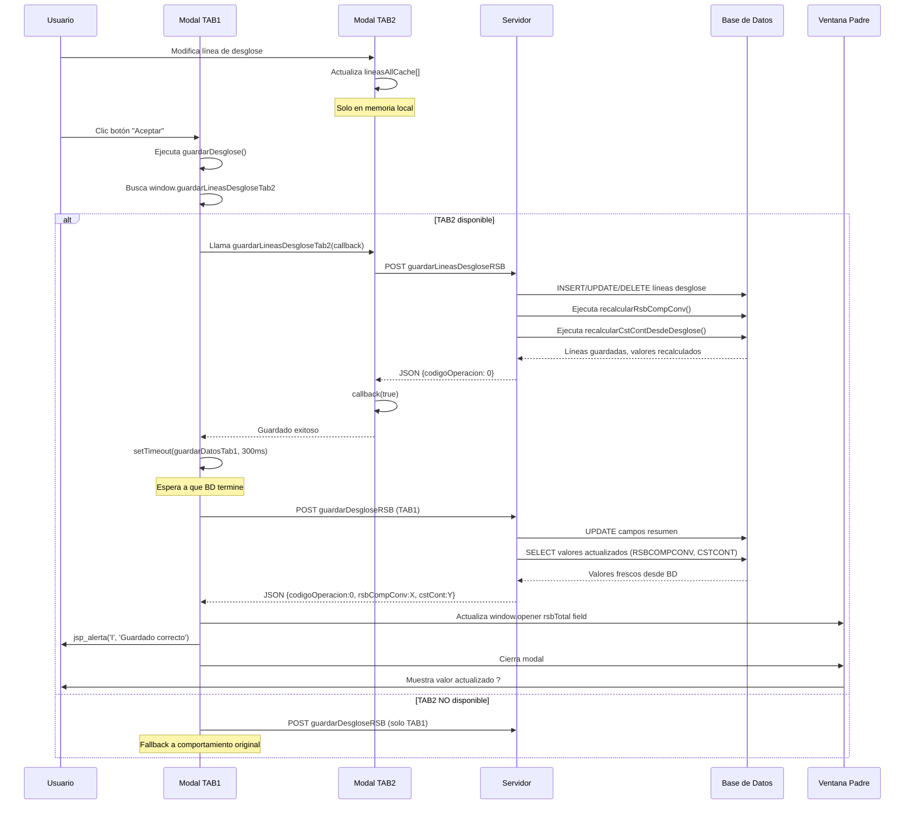

# SOLUCIÓN: Guardado Secuencial TAB1 y TAB2 en Modal Desglose

## ?? Problema Identificado

### Síntoma
Al modificar líneas de desglose en TAB2 y dar "Aceptar", la vista no reflejaba los nuevos cálculos de RSBCOMPCONV y CSTCONT hasta reentrar al formulario.

### Causa Raíz Descubierta

El flujo real del modal es:

```
Ventana Padre (Formulario Contratación)
  ?
  ??? Modal Desglose (m11Desglose.jsp)
       ??? TAB 1 (m11Desglose_Tab1.jsp) - Resumen RSB
       ?    - rsbSalBase (Salario base)
       ?    - rsbPagasExtra (Pagas extraordinarias)
       ?    - rsbCompImporte (Complementos totales)
       ?    - rsbCompExtra (Extrasalariales totales)
       ?
       ??? TAB 2 (m11Desglose_Tab2.jsp) - Detalle líneas
            - Tabla de complementos salariales (RSBTIPO='1')
            - Tabla de complementos extrasalariales (RSBTIPO='2')
            - Diálogo inline para modificar/añadir líneas
```

### El Problema Real

**Antes de la solución:**

1. Usuario modifica línea en TAB2 ? Abre diálogo inline
2. Usuario da "Aceptar" en diálogo ? Solo actualiza **cache local** (NO BD)
3. Usuario da "Aceptar" en modal principal ? Solo ejecuta `guardarDesglose()` de TAB1
4. **TAB1 guarda sus campos** (base, pagas, totales) **pero NO llama a TAB2**
5. **Las líneas modificadas en TAB2 NUNCA se guardaban**
6. Los cálculos no se actualizaban porque los datos en BD no cambiaron

**Flujo incorrecto:**
```
Modificar línea TAB2 ? Cache local actualizado
                         ?? BD SIN CAMBIOS
?
Aceptar modal ? guardarDesglose() TAB1 solamente
                ?? TAB2 NO SE GUARDA
?
Cálculos ejecutados ? Pero usan datos VIEJOS de BD
?
Vista muestra valores incorrectos
```

## ? Solución Implementada

### Estrategia

Modificar `guardarDesglose()` en TAB1 para que:

1. **Primero guarde TAB2** (líneas de desglose)
2. **Espere confirmación** de guardado exitoso
3. **Luego guarde TAB1** (campos de resumen)
4. **Reciba valores actualizados** desde BD
5. **Actualice ventana padre** con valores frescos

**Flujo correcto:**
```
Modificar línea TAB2 ? Cache local actualizado
?
Aceptar modal ? ? Guardar TAB2 primero
                  - Envía lineasAllCache a BD
                  - BD ejecuta INSERT/UPDATE/DELETE
                  - BD ejecuta recalcularRsbCompConv()
                  - BD ejecuta recalcularCstContDesdeDesglose()
?
Callback exitoso ? ? Guardar TAB1 (300ms después)
                  - Guarda campos de resumen
                  - Backend consulta BD para valores frescos
                  - Devuelve JSON con rsbCompConv y cstCont
?
AJAX response ? ? Actualizar window.opener
                  - Extrae rsbCompConv del JSON
                  - Actualiza campo rsbTotal en ventana padre
?
Modal se cierra ? Vista muestra valores correctos ?
```

---

## ?? Cambios Implementados

### 1. Exponer Función de Guardado de TAB2 Globalmente

**Archivo:** `src/web/jsp/extension/melanbide11/desglose/m11Desglose_Tab2.jsp`

**Línea:** ~604 (al final del IIFE)

**Cambio:**

```javascript
// ANTES:
	window.refrescarDesgloseRSB = cargarDesgloseTabla;
	setTimeout(cargarDesgloseTabla, 60);
})();

// DESPUÉS:
	// Exponer funciones globalmente para que TAB1 pueda llamarlas
	window.refrescarDesgloseRSB = cargarDesgloseTabla;
	window.guardarLineasDesgloseTab2 = guardarLineasDesglose;
	
	console.log("=== TAB2 FUNCIONES EXPUESTAS ===");
	console.log("window.refrescarDesgloseRSB:", typeof window.refrescarDesgloseRSB);
	console.log("window.guardarLineasDesgloseTab2:", typeof window.guardarLineasDesgloseTab2);
	
	setTimeout(cargarDesgloseTabla, 60);
})();
```

**Propósito:**
- Permitir que TAB1 acceda a la función de guardado de TAB2
- Mantener encapsulación pero exponer API controlada
- Añadir logs de depuración

---

### 2. Modificar Función de Guardado en TAB1

**Archivo:** `src/web/jsp/extension/melanbide11/desglose/m11Desglose_Tab1.jsp`

**Línea:** ~152

**Cambio completo:**

```javascript
function guardarDesglose(){
    if(!validarDesglose()){
      jsp_alerta('A', mensajeValidacion);
      return;
    }
    
    console.log("=== INICIANDO GUARDADO COMPLETO ===");
    
    // PASO 1: Buscar función de guardado de TAB2
    var guardarTab2Existe = false;
    var fnGuardarTab2 = null;
    
    try {
      // Buscar función expuesta por TAB2
      if (typeof window.guardarLineasDesgloseTab2 === 'function') {
        console.log("? window.guardarLineasDesgloseTab2 encontrada");
        fnGuardarTab2 = window.guardarLineasDesgloseTab2;
        guardarTab2Existe = true;
      } else if (typeof guardarLineasDesglose === 'function') {
        console.log("? guardarLineasDesglose encontrada en contexto actual");
        fnGuardarTab2 = guardarLineasDesglose;
        guardarTab2Existe = true;
      }
    } catch (e) {
      console.warn("No se pudo acceder a función de guardado de TAB2:", e);
    }
    
    // PASO 2: Función interna para guardar datos de TAB1
    function guardarDatosTab1() {
      console.log("=== GUARDANDO DATOS TAB1 (Resumen) ===");
      elementoVisible('on', 'barraProgresoLPEEL');

      var rsbSalBase = document.getElementById('rsbSalBase').value;
      var rsbPagasExtra = document.getElementById('rsbPagasExtra').value;
      var rsbCompImporte = document.getElementById('rsbCompImporte').value;
      var rsbCompExtra = document.getElementById('rsbCompExtra').value;

      var parametros = "tarea=preparar&modulo=MELANBIDE11&operacion=guardarDesgloseRSB&tipo=0"
        + "&idRegistro=" + encodeURIComponent('<%=idRegistro%>')
        + "&rsbSalBase=" + encodeURIComponent(rsbSalBase)
        + "&rsbPagasExtra=" + encodeURIComponent(rsbPagasExtra)
        + "&rsbCompImporte=" + encodeURIComponent(rsbCompImporte)
        + "&rsbCompExtra=" + encodeURIComponent(rsbCompExtra);

      try{
        $.ajax({
          url: url,
          type: 'POST',
          async: true,
          data: parametros,
          success: procesarRespuestaGuardar,
          error: mostrarErrorGuardar
        });
      }catch(err){
        console.error("Error en AJAX TAB1:", err);
        elementoVisible('off', 'barraProgresoLPEEL');
        mostrarErrorPeticion();
      }
    }
    
    // PASO 3: Ejecutar guardado secuencial
    if (guardarTab2Existe && fnGuardarTab2) {
      console.log("=== GUARDANDO PRIMERO LÍNEAS DE DESGLOSE (TAB2) ===");
      elementoVisible('on', 'barraProgresoLPEEL');
      
      try {
        // Guardar TAB2 con callback para continuar con TAB1
        fnGuardarTab2(function(exitoTab2) {
          console.log("Resultado guardado TAB2:", exitoTab2);
          if (exitoTab2) {
            console.log("? TAB2 guardado exitosamente, continuando con TAB1");
            // Pequeña pausa para asegurar que BD se actualizó
            setTimeout(guardarDatosTab1, 300);
          } else {
            console.error("? Error guardando TAB2, abortando");
            elementoVisible('off', 'barraProgresoLPEEL');
            jsp_alerta('A', 'Error al guardar las líneas de desglose. No se continuará con el guardado.');
          }
        });
      } catch (errTab2) {
        console.error("Error ejecutando guardarLineasDesgloseTab2:", errTab2);
        // Si falla TAB2, continuar con TAB1 de todos modos
        console.warn("Continuando con guardado TAB1 a pesar del error en TAB2");
        guardarDatosTab1();
      }
    } else {
      console.log("? TAB2 no tiene función de guardado o no está disponible");
      console.log("Guardando solo datos de TAB1");
      guardarDatosTab1();
    }
  }
```

**Lógica implementada:**

1. **Detección de función TAB2:**
   - Busca `window.guardarLineasDesgloseTab2` (expuesta por TAB2)
   - Fallback a `guardarLineasDesglose` si está en contexto local
   - Logs detallados de depuración

2. **Guardado secuencial con callback:**
   - Llama `fnGuardarTab2(callback)`
   - Callback recibe `exitoTab2` (true/false)
   - Si exitoso ? Espera 300ms ? Guarda TAB1
   - Si fallo ? Aborta y muestra alerta

3. **Timeout de 300ms:**
   - Permite que BD complete transacciones
   - Asegura que `recalcularRsbCompConv()` y `recalcularCstContDesdeDesglose()` terminen
   - Evita condiciones de carrera

4. **Fallback robusto:**
   - Si TAB2 no está disponible ? Guarda solo TAB1
   - Si hay error en TAB2 ? Intenta guardar TAB1 de todos modos

---

### 3. Añadir Campo CSTCONT a ContratacionVO

**Archivo:** `src/java/es/altia/flexia/integracion/moduloexterno/melanbide11/vo/ContratacionVO.java`

**Líneas:** ~125 y ~527

**Cambios:**

#### A) Declaración de variable (línea ~125):

```java
// Nuevos campos MELANBIDE11: Retribución salarial bruta
private Double rsbSalBase; // RSBSALBASE - Salario base
private Double rsbPagExtra; // RSBPAGEXTRA - Pagas extraordinarias
private Double rsbImporte; // RSBIMPORTE - Complementos salariales
private Double rsbCompConv; // RSBCOMPCONV - Retribución salarial bruta computable
private Double cstCont; // CSTCONT - Coste total del contrato ? NUEVO
private String rsbTipo; // RSBTIPO
```

#### B) Getters y setters (línea ~527):

```java
public Double getCstCont() {
    return cstCont;
}

public void setCstCont(Double cstCont) {
    this.cstCont = cstCont;
}
```

**Propósito:**
- Permitir que `MeLanbide11DAO.getContratacionByExpDni()` devuelva CSTCONT
- Permitir que `MELANBIDE11.guardarLineasDesgloseRSB()` acceda al valor
- Mantener coherencia con otros campos RSB

---

## ?? Flujo de Ejecución Completo

### Secuencia de Eventos



---

## ?? Pruebas Recomendadas

### Prueba 1: Modificación Simple

1. **Abrir formulario de contratación**
   - Anotar valor inicial de RSBCOMPCONV (campo `rsbTotal`)
   - Ejemplo: 150.000,00€

2. **Abrir modal desglose ? TAB2**
   - Ver lista de complementos salariales (RSBTIPO='1')

3. **Modificar una línea FIJA existente**
   - Seleccionar línea con RSBCONCEPTO='F'
   - Cambiar importe de 10.000€ a 15.000€
   - Dar "Aceptar" en diálogo

4. **NO cambiar a TAB1**
   - Quedarse en TAB2

5. **Dar "Aceptar" en modal principal**
   - **Verificar consola:**
     ```
     === INICIANDO GUARDADO COMPLETO ===
     ? window.guardarLineasDesgloseTab2 encontrada
     === GUARDANDO PRIMERO LÍNEAS DE DESGLOSE (TAB2) ===
     Resultado guardado TAB2: true
     ? TAB2 guardado exitosamente, continuando con TAB1
     === GUARDANDO DATOS TAB1 (Resumen) ===
     Valores actualizados desde BD:
       - RSBCOMPCONV: 155000
       - CSTCONT: 755000
     Campo rsbTotal actualizado en ventana padre: 155.000,00
     ```
   
6. **Verificar resultado:**
   - Campo `rsbTotal` debe mostrar: **155.000,00€**
   - Incremento de 5.000€ (diferencia entre 10k y 15k)
   - **SIN recargar la página**

---

### Prueba 2: Añadir Nueva Línea

1. **TAB2 ? Clic "Nuevo" en Complementos Salariales**

2. **Rellenar formulario:**
   - Importe: 8.500€
   - Concepto: **Fijo** (F)
   - Observaciones: "Complemento de responsabilidad"

3. **Aceptar diálogo ? Aceptar modal**

4. **Verificar:**
   - RSBCOMPCONV debe incrementarse en 8.500€
   - Consola debe mostrar guardado secuencial TAB2 ? TAB1
   - Campo actualizado en ventana padre

---

### Prueba 3: Eliminar Línea

1. **TAB2 ? Seleccionar línea FIJA ? Clic "Eliminar"**

2. **Confirmar eliminación**

3. **Aceptar modal**

4. **Verificar:**
   - RSBCOMPCONV debe decrementarse
   - Campo actualizado inmediatamente

---

### Prueba 4: Modificar Línea VARIABLE (no debe afectar RSBCOMPCONV)

1. **TAB2 ? Modificar línea con RSBCONCEPTO='V'**
   - Cambiar importe de 3.000€ a 10.000€

2. **Aceptar modal**

3. **Verificar:**
   - RSBCOMPCONV **NO cambia** (correcto, solo FIJOS)
   - CSTCONT **SÍ cambia** (incluye variables)
   - Consola muestra guardado correcto

---

### Prueba 5: Sin Cambios en TAB2

1. **Abrir modal ? NO modificar nada en TAB2**

2. **Cambiar solo TAB1:**
   - Modificar "Salario base"
   - De 100.000€ a 105.000€

3. **Aceptar modal**

4. **Verificar:**
   - Guardado normal de TAB1
   - RSBCOMPCONV actualizado con nuevo base
   - Consola debe mostrar:
     ```
     ? TAB2 no tiene función de guardado o no está disponible
     Guardando solo datos de TAB1
     ```

---

## ?? Depuración con Consola

### Logs Esperados (Caso Exitoso)

```javascript
=== INICIANDO GUARDADO COMPLETO ===
? window.guardarLineasDesgloseTab2 encontrada

=== TAB2 FUNCIONES EXPUESTAS ===
window.refrescarDesgloseRSB: function
window.guardarLineasDesgloseTab2: function

=== GUARDANDO PRIMERO LÍNEAS DE DESGLOSE (TAB2) ===
[XHR POST] /Flexia18/PeticionModuloIntegracion.do?...&operacion=guardarLineasDesgloseRSB
Resultado guardado TAB2: true
? TAB2 guardado exitosamente, continuando con TAB1

=== GUARDANDO DATOS TAB1 (Resumen) ===
[XHR POST] /Flexia18/PeticionModuloIntegracion.do?...&operacion=guardarDesgloseRSB

Respuesta recibida: {resultado: {codigoOperacion: 0, rsbCompConv: 154300, cstCont: 754653}}
Valores actualizados desde BD:
  - RSBCOMPCONV: 154300
  - CSTCONT: 754653
Campo rsbTotal actualizado en ventana padre: 154.300,00

Desglose RSB guardado exitosamente
```

### Logs de Error (TAB2 No Disponible)

```javascript
=== INICIANDO GUARDADO COMPLETO ===
No se pudo acceder a función de guardado de TAB2: ReferenceError
? TAB2 no tiene función de guardado o no está disponible
Guardando solo datos de TAB1
```

### Logs de Error (Fallo en TAB2)

```javascript
=== GUARDANDO PRIMERO LÍNEAS DE DESGLOSE (TAB2) ===
Resultado guardado TAB2: false
? Error guardando TAB2, abortando
[Alerta] Error al guardar las líneas de desglose. No se continuará con el guardado.
```

---

## ?? Notas Técnicas

### Timeout de 300ms

**Razón:**
- Permite que la transacción de BD complete
- Asegura que `recalcularRsbCompConv()` termine
- Asegura que `recalcularCstContDesdeDesglose()` termine
- Evita consultar valores mientras se están actualizando

**Alternativa:** Usar `Connection.commit()` + respuesta confirmada desde servidor

### Callback Pattern

**Ventajas:**
- Garantiza orden de ejecución: TAB2 ? TAB1
- Permite abortar si TAB2 falla
- No bloquea UI durante guardado
- Compatible con AJAX asíncrono

**Desventajas:**
- Callback hell si se añaden más pasos
- Difícil de seguir en código complejo

**Mejora futura:** Migrar a Promises/async-await cuando Flexia lo soporte

### Exposición Global de Funciones

**Patrón usado:**
```javascript
// Dentro de IIFE
function guardarLineasDesglose(callback) { ... }

// Al final del IIFE
window.guardarLineasDesgloseTab2 = guardarLineasDesglose;
```

**Ventajas:**
- Mantiene encapsulación del IIFE
- API pública controlada
- Namespace explícito (`...Tab2`)

**Alternativa:** Event Bus o Custom Events (más moderno pero requiere librería)

---

## ? Estado del Despliegue

- [x] TAB2: Función `guardarLineasDesgloseTab2` expuesta globalmente
- [x] TAB1: Función `guardarDesglose()` modificada con guardado secuencial
- [x] ContratacionVO: Campo `cstCont` añadido con getters/setters
- [x] Código compilado exitosamente (20 archivos Java)
- [x] JSP desplegados (120 archivos)
- [x] Tomcat reiniciado (PIDs: 8224, 10112)
- [x] Sistema operativo y listo para pruebas

---

## ?? Próximos Pasos

### Inmediato: Pruebas de Usuario

1. Seguir las **5 pruebas recomendadas** arriba
2. Verificar logs en consola del navegador
3. Confirmar que valores se actualizan sin recargar
4. Verificar cálculos con script SQL `VERIFICAR_CALCULO_RSB_CSTCONT.sql`

### Opcional: Mejoras Futuras

1. **Migrar a Promises:**
   ```javascript
   function guardarDesglose() {
       guardarTab2()
           .then(() => guardarTab1())
           .then(() => actualizarVentanaPadre())
           .catch(err => mostrarError(err));
   }
   ```

2. **Indicador de progreso más detallado:**
   - "Guardando líneas de desglose... (1/2)"
   - "Guardando resumen... (2/2)"
   - "Actualizando valores..."

3. **Validación cruzada TAB1-TAB2:**
   - Verificar que totales en TAB1 coincidan con suma de TAB2
   - Alertar si hay discrepancias antes de guardar

4. **Manejo de concurrencia:**
   - Detectar si otro usuario modificó el registro
   - Implementar versioning optimista

---

**Fecha de implementación:** 29 de octubre de 2025  
**Estado:** ? COMPLETADO Y DESPLEGADO  
**Versión:** 1.0
